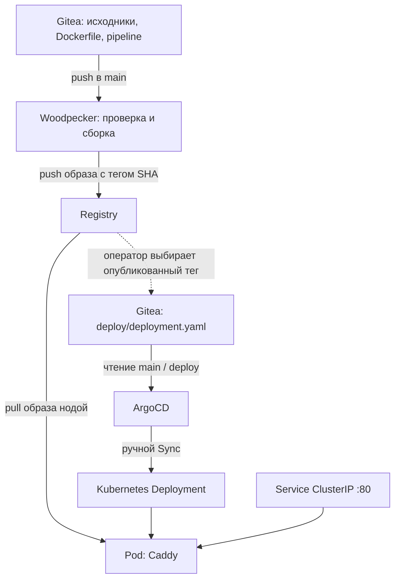

# land: архитектура и эксплуатация доставки

Состояние на 19 сентября 2026 года.

`land` — статический сайт на Hugo, который раздаётся Caddy в k3s.
Доставка связывает приватный Gitea, Woodpecker CI, Docker Registry и ArgoCD:
изменение исходников превращается в образ, затем выбранная версия образа
фиксируется в Git и применяется в кластере.

[Файлы конфигурации](../examples/land/README.md) опубликованы как пример.
История настройки, ошибки и подтверждающие выводы команд находятся
в [журнале работ](ops/land-gitops-delivery.md).

## Компоненты и ответственность

| Компонент | Размещение | Ответственность |
|---|---|---|
| Gitea, `Igor/land` | VM102, `192.168.1.40:3000` | Исходники сайта, Dockerfile, pipeline и `deploy/` |
| Woodpecker server и agent | VM103, `192.168.1.50` | Реакция на push, проверка сайта, сборка и публикация образа |
| Docker Registry | Pi5, `registry.homelab.local:5000` | Хранение образов, HTTPS и Basic Auth |
| ArgoCD | k3s, namespace `argocd` | Чтение `deploy/` из Git и применение манифестов |
| Deployment и Service `land` | k3s, namespace `land` | Запуск Caddy и внутренний доступ к сайту |

Рабочая копия приватного репозитория находится на VM103 в `~/land`.
Публичный `homelab-infrastructure` хранит документацию и примеры;
ArgoCD не использует его как источник приложения `land`.
Обновление Woodpecker до 3.18.1 описано [отдельно](ops/woodpecker-upgrade.md).

## Путь изменения



Здесь два разных Git-коммита: коммит исходников определяет тег образа,
а следующий коммит манифеста выбирает этот тег для запуска.
SHA манифеста не нужно подставлять вместо SHA собранных исходников.
ArgoCD читает Git; наличие нового образа в Registry само по себе не меняет Deployment.

| Действие | Как выполняется |
|---|---|
| Push исходников → запуск CI → публикация образа | Автоматически |
| Изменение `image:` в манифесте и push | Вручную |
| Применение новой версии | Ручной Sync в ArgoCD |
| Создание pod и проверка readiness | Kubernetes |
| Возврат предыдущей версии | Коммит в Git и ручной Sync |

## Сборка и pipeline

[Dockerfile](../examples/land/Dockerfile) использует две стадии:
Hugo `0.111.3-ext-alpine` собирает `site/` в `/out`, затем файлы копируются
в `/usr/share/caddy` образа `caddy:2-alpine`. Это корень штатного Caddyfile.
Hugo и исходники не нужны для обслуживания HTTP в итоговом контейнере.

В конфигурации сайта задан `baseURL = "/"`. Проверенные ссылки на CSS
ведут к тому же серверу, что и страница. Полный аудит внешних ресурсов сайта
не выполнялся. Для публикации под подкаталогом понадобится отдельная настройка.

[Pipeline](../examples/land/.woodpecker.yml) реагирует на `push` в `main`:

1. `build-site` собирает Hugo и проверяет, что `index.html` существует и непустой.
2. `build-and-push` через Docker CLI собирает образ
   `registry.homelab.local:5000/land:${CI_COMMIT_SHA}`.
3. Выполняет login с repository secrets и отправляет образ в Registry.

Проверка `index.html` выявляет ошибки сборки, но не заменяет проверку содержимого
и HTTP после развёртывания. Предупреждения Hugo о taxonomy при проверенном
запуске не останавливали сборку.

Docker CLI использует `/var/run/docker.sock` VM103. Для такого volume требуется
доверенный репозиторий Woodpecker; доступ к сокету даёт широкие права на Docker-хосте.
Эта схема рассчитана на собственный репозиторий с контролируемыми изменениями.

## Доступы и зависимости

| Доступ | Где настроен |
|---|---|
| Gitea → Woodpecker | Webhook репозитория; имя Woodpecker должно разрешаться внутри контейнера Gitea |
| Woodpecker → Gitea | OAuth-приложение; callback согласован с `WOODPECKER_HOST` |
| CI → Registry | Repository secrets `registry_username` и `registry_password`, разрешённые для `push` |
| ArgoCD → приватный Git | Подключение репозитория в ArgoCD с отдельными учётными данными |
| Нода → Registry | DNS, доверие к internal CA и `imagePullSecrets` приложения |

Docker login в SSH-сессии не настраивает автоматически CI-контейнер или k3s.
В pipeline `DOCKER_CONFIG=/tmp/docker-auth`; пароль передаётся через stdin,
значения берутся из секретов во время выполнения. OpenBao в этой цепочке
секретов приложения пока не используется.

Namespace `land` и Secret `registry-credentials` создаются до первого Sync.
Secret имеет тип `kubernetes.io/dockerconfigjson` и запись для
`registry.homelab.local:5000`; значение в Git не хранится.
Подготовить его можно на машине с Docker CLI и доступом kubectl к кластеру:

```bash
# Если namespace ещё отсутствует:
kubectl create namespace land

# Пароль вводится интерактивно; docker config остаётся во временном каталоге.
registry_auth_dir=$(mktemp -d)
docker --config "$registry_auth_dir" login registry.homelab.local:5000 --username ci
kubectl -n land create secret generic registry-credentials \
  --type=kubernetes.io/dockerconfigjson \
  --from-file=.dockerconfigjson="$registry_auth_dir/config.json"
rm -f "$registry_auth_dir/config.json"
rmdir "$registry_auth_dir"
unset registry_auth_dir
```

Это процедура первоначального создания. Существующий Secret проверяется
через `kubectl -n land get secret registry-credentials`; его содержимое
не нужно выводить в журнал или документацию.

DNS и TLS проверяются на worker-нодах, которые скачивают образ.
Registry разрешается в `192.168.1.10` и использует HTTPS на порту 5000.
Учётные данные не устраняют ошибку DNS или недоверенный сертификат.
Настройка Registry и CA описана в [registry-tls-auth.md](ops/registry-tls-auth.md).

На `k3-worker-2` для systemd-resolved добавлен route domain `~homelab.local`:
запросы этой зоны направляются DNS-серверу роутера `192.168.1.1`.
Runtime-проверка и pull прошли; Netplan-конфигурация подготовлена и проверена
генерацией, сохранение поведения после перезагрузки пока не подтверждено.
На втором amd64 worker такой pull в рамках этого кейса не проверялся.

## Настройка ArgoCD

Application `land` создан в интерфейсе ArgoCD со следующими параметрами:

| Поле | Значение |
|---|---|
| Project | `default` |
| Repository URL | `http://192.168.1.40:3000/Igor/land.git` |
| Revision | `main` |
| Path | `deploy` |
| Destination cluster | `https://kubernetes.default.svc` |
| Destination namespace | `land` |
| Sync policy | Manual |

В `deploy/` лежат только Deployment и Service. Подключение репозитория,
Application, namespace и registry secret подготовлены отдельно.
Auto-sync, автоматический prune и self-heal в этом сценарии не включены.
Различия ручного и автоматического применения описаны в
[документации ArgoCD](https://argo-cd.readthedocs.io/en/stable/user-guide/auto_sync/).

## Конфигурация workload

[Deployment](../examples/land/deploy/deployment.yaml) запускает одну реплику
на `amd64`: образ собран на VM103 для этой архитектуры, control-plane Pi5 — `arm64`.
Pull secret привязан к pod через `imagePullSecrets`.

Caddy слушает порт 80. Readiness probe проверяет `/` каждые 5 секунд,
начиная через 2 секунды. Запрос ресурсов — `50m` CPU / `32Mi` памяти,
лимит — `500m` / `128Mi`. Это стартовые значения стенда; нагрузочный тест не проводился.

[Service](../examples/land/deploy/service.yaml) выбирает pod по метке `app: land`
и направляет TCP/80 на именованный порт `http`. Тип `ClusterIP` обеспечивает
внутренний доступ. Ingress и публичный домен для `land` ещё не настроены.

Стратегия Deployment явно не переопределена — используется RollingUpdate.
При одной реплике значения по умолчанию позволяют создать дополнительный pod,
не удаляя единственный доступный до готовности замены.
Это объясняет сохранение старой реплики в проверенном сценарии с отсутствующим
тегом, но не даёт отказоустойчивости при потере самой ноды.
Семантика стратегии — в [документации Kubernetes](https://kubernetes.io/docs/concepts/workloads/controllers/deployment/).

## Выпуск версии

Команды Git выполняются на VM103 из `~/land`, где рабочее дерево должно быть чистым
перед началом отдельного изменения.

1. Изменить сайт, просмотреть diff, создать коммит и отправить его в `main`.
2. Дождаться успешного `build-and-push`. Записать полный SHA коммита этого pipeline.
3. В `deploy/deployment.yaml` заменить только тег `image:` на опубликованный SHA.
4. Зафиксировать изменение манифеста:

   ```bash
   git diff -- deploy/deployment.yaml
   git add deploy/deployment.yaml
   git commit -m "Deploy updated land image [skip ci]"
   git push
   ```

5. В ArgoCD обновить состояние Application, проверить diff и выполнить Sync.
6. С машины с kubectl проверить rollout и ответ сайта:

   ```bash
   kubectl -n land rollout status deployment/land --timeout=120s
   kubectl -n land get pods -o wide
   kubectl -n land get deployment land -o jsonpath='{.spec.template.spec.containers[0].image}'
   ```

Для HTTP-проверки из сети кластера, например на `homelab`:

```bash
land_service_ip=$(kubectl -n land get service land -o jsonpath='{.spec.clusterIP}')
curl -fsS "http://${land_service_ip}/" -o /tmp/land-index.html
grep -o '<title>[^<]*</title>' /tmp/land-index.html
curl -fsS -o /dev/null -w 'CSS HTTP %{http_code}\n' "http://${land_service_ip}/css/style.css"
```

Успех — rollout завершён, pod `1/1 Running`, выбран ожидаемый образ,
HTTP-заголовок страницы отражает изменение, CSS доступен. В ArgoCD дополнительно
проверяются `Synced` и `Healthy`: синхронизация манифестов сама по себе
ещё не означает, что контейнер запустился.

## Диагностика и откат

Если rollout не завершился, сначала получить события:

```bash
kubectl -n land get pods -o wide
kubectl -n land describe pod <имя-нового-pod>
```

`ImagePullBackOff` обозначает повторные неудачи скачивания, а точную причину
нужно читать в Events: DNS, TLS, авторизация или отсутствующий тег.
В проверенном эксперименте Registry отвечал `not found` для `does-not-exist-test`.

Возврат выполняется через Git: вернуть в `image:` последний рабочий тег,
проверить diff, создать коммит с `[skip ci]`, отправить его и выполнить Sync.
Если ошибку внёс отдельный коммит только с изменением манифеста, его можно
отменить через `git revert --no-commit <SHA-коммита-манифеста>` и после проверки
создать коммит возврата. Отменяется именно выбор версии, а не исходный код сайта.

После возврата повторяются проверки rollout, образа и HTTP. Kubernetes не делает
такой Git-откат автоматически. В кейсе рабочий pod сохранился, ошибочный pod
исчез, заголовок сайта остался ожидаемым.

## Подтверждённый результат и ограничения

Проверенная версия образа — `cee7e25dc06e319b248c8deee38554c4564fec19`.
Для неё подтверждены сборка, push, запуск на `k3-worker-2`, HTTP 200 и заголовок
`Devops quiz - обновлено через CI/CD`. Проверен также возврат рабочего тега
после намеренно неудачного rollout. Непрерывное измерение доступности не проводилось.

Тег SHA связывает образ с исходниками, но не гарантирует неизменяемость:
Registry не запрещает перезапись тега, а базовые образы закреплены тегами,
не digest. Multi-arch сборка, автоматическое обновление манифеста, auto-sync,
Ingress и нагрузочные проверки остаются за границами текущей реализации.
